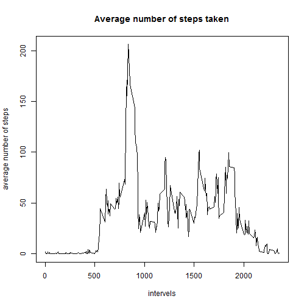
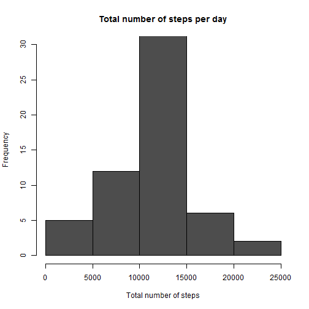
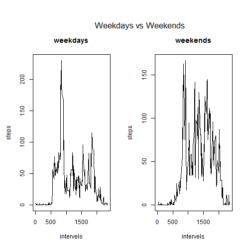

Reproducible Research Course Project 1
=====================================


## Loading and preprocessing the data


```r
act<-read.csv("C:/xfmovie/activity.csv",header=T,stringsAsFactors = FALSE)
act$date<-as.Date(act$date)
```


## What is mean total number of steps taken per day?


```r
total<-aggregate(act$steps,by=list(act$date),FUN=function(elt) sum(elt,na.rm=TRUE))

# histogram of the total number of steps taken each day
hist(total$x,main="Total number of steps per day",xlab="Total number of steps",ylim=c(0,30),col="grey30")
```


```r
med<-median(total$x,na.rm=TRUE)
ave<-mean(total$x,na.rm=TRUE)
```

The median of the total number of steps taken per day is 10395. The mean of the total number of steps taken per day is 9354.


## What is the average daily activity pattern?


```r
ave<-aggregate(act$steps,by=list(act$interval),FUN=function(elt) mean(elt,na.rm=TRUE))

# a time series plot of the 5-minute interval and the average number of steps taken, averaged across all days
plot(ave$Group.1,ave$x,type="l",xlab="intervels",ylab="average number of steps",main="Average number of steps taken")
```



```r
maxstep<-max(ave$x)
stepmax<-ave$Group.1[which.max(ave$x)]
```

The maximum average steps in an interval is 206 steps at 835 minutes.


## Imputing missing values


```r
nanum<-sum(is.na(act))
```

There are 2304 missing values in the data set.


```r
# use the mean for that 5-minute interval to fill in all of the missing values
d<-unique(act$date[is.na(act)])
fullact<-act
for(i in d){
        fullact[which(fullact$date==i),][,1]<-ave$x
}
newtotal<-aggregate(fullact$steps,by=list(fullact$date),FUN=function(elt) sum(elt,na.rm=TRUE))

# a histogram of the total number of steps taken each day 
hist(newtotal$x,main="Total number of steps per day",xlab="Total number of steps",ylim=c(0,30),col="grey30")
```



```r
newmed<-round(median(newtotal$x))
newave<-round(mean(newtotal$x))
```

After filling in all the missing values, the median of the total number of steps taken per day is 1.0766 &times; 10<sup>4</sup>. The mean of the total number of steps taken per day is 1.0766 &times; 10<sup>4</sup>.

With all the missing values filled with the mean for 5-minute intervals, the mean and median both becomes larger than before.


## Are there differences in activity patterns between weekdays and weekends?


```r
# I am from China and my computer only supports Chinese. So all the dates on my computer are in Chinese."星期六" is equal to "Saturday" and "星期日" is equal to "Sunday"
fullact$date<-as.Date(fullact$date)
fullact$week<-"0"
fullact[which(weekdays(fullact$date)=="星期六"|weekdays(fullact$date)=="星期日"),]$week<-"weekend"
fullact[which(fullact$week=="0"),]$week<-"weekday"
fullact$week<-as.factor(fullact$week)
newave<-aggregate(fullact$steps,by=list(fullact$interval,fullact$week),FUN=mean)

# a panel plot containing a time series plot of the 5-minute interval and the average number of steps taken, averaged across all weekday days or weekend days.
op<-par(mfrow=c(1,2),omi=c(0.1,0.1,0.7,0.1))
plot(newave[newave$Group.2=="weekday",]$Group.1,newave[newave$Group.2=="weekday",]$x,type="l",main="weekdays",xlab="intervels",ylab="steps")
plot(newave[newave$Group.2=="weekend",]$Group.1,newave[newave$Group.2=="weekend",]$x,type="l",main="weekends",xlab="intervels",ylab="steps")
par(op)
mtext("Weekdays vs Weekends",cex=1.4)  
```


